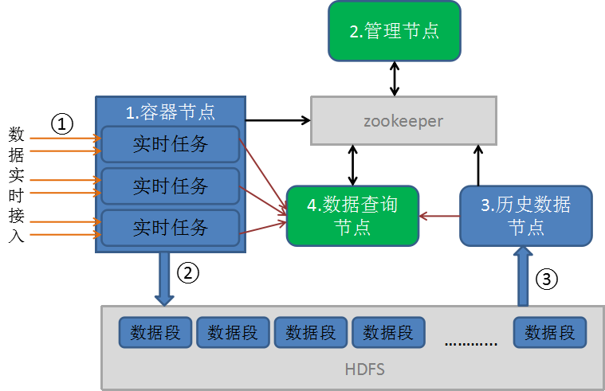
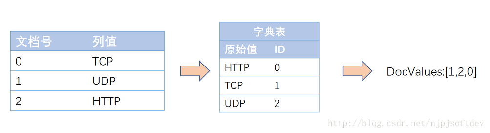

Tindex技术白皮书
==================================================

## 摘要  

Tindex是一个基于原始数据存储的多维实时分析分布式数据仓库，该系统融合了搜索引擎的索引技术，采用分布式、无共享的体系架构。  
它具有以下特性：  
* 数据实时接入，实时可查  
* 数据无损  
* 查询指标灵活定义  
* 支持上万维度   
在本文中，我们将描述Tindex的体系结构，并详细介绍Tindex如何支持快速聚合，灵活过滤，和低延迟数据接入，以及测试结果。

## 1 引言  

互联网的发展产生了大量的数据，如何存储和分析这些数据，显得越来越重要，对于技术来说，亦是挑战。目前，对于这些数据的存储分析还主要是两种方式：
一种是基于Hadoop的离线批量处理，例如Hive；另外一种是预聚合处理。  

Hadoop项目已经相当成熟，3.0的新特性更是吸引了很多人的目光，被许多组织机构或公司部署用于大规模日志数据的存储和分析。
Hadoop正在或已经帮助一些公司做大数据分析，将聚合结果转化的一系列应用(比如商业智能BI和A-B测试)都卓有成效。
具体来说，Hadoop非常擅长存储并提供大规模数据的访问。虽然Hadoop是一个高可用的系统，但它目前解决的问题还是局限在数据存储和批处理，
根本无法保证数据实时性，无法做到数据接入即可随机查询，更无法做到查询的秒级响应。  

正是由于Hadoop的局限性，为了快速的从一个个零散的数据事件的快速聚合出价值较高的结果，近几年基于OLAP的思想的预聚合系统如雨后春笋般爆发，
最典型的代表莫过于Druid和Kylin。预聚合的框架能够做到数据的实时性和快速的并发查询，但是劣势也非常明显，它所适用的模型相对固定。
预聚合的系统通常情况下是通过定义时间、维度和指标，然后按照时间粒度将维度组合作为行，在数据接入的时候实时统计每行的指标。
如此便能保证数据的实时性，但维度组合相当于将各个维度做笛卡尔积，为了保证数据的快速查询，注定行不宜过多。
为了减少预聚合的行数，维度必须裁剪，同时也不能包含高基数维度。
这些都会限制了业务的发展，一旦业务发生变更，大部分时候需要重新调整模型，已有预聚合的数据基本不可用，需要重新调整预聚合模型。  

在数果智能早起产品开发和定位的时候，我们就已经意识到了Hadoop技术非常适合作为数据存储和批处理，
随着技术的发展，预聚合框架只能作为一个辅助功能，来提升查询性能，而实际的数据分析和查询应该是基于原始数据的，指标是可以自由定制的，而不需要重新建立模型。  

基于这些考虑，数果智能结合开源的搜索引擎技术和预聚合框架重新研发了一套存储查询分析平台Tindex。一款成功的产品，需要站在巨人的肩上，数果智能研发的Tindex也不例外。选择搜索引擎技术，因为其强大的索引机制，能够满足数据筛选过滤，甚至能够应对需要分词的场景，选择预聚合的框架则是因为它的指标定义非常灵活，两者相结合，便能够满足我们所有的查询分析场景。  

关于Tindex的详细描述，我们将从以下几方面介绍：  
* Tindex的架构实现  
* Tindex存储格式
* Tindex的查询分析   
* 与大数据生态圈的结合  

## 2 架构实现  

Tindex的架构设计参考了多种开源查询分析引擎，最终以一种无共享的架构来实现不同的功能点，任何节点都具有HA特性，可以根据生产环境任意启动不同的节点。我们相信这种设计分离了关注点，同时简化了整个系统的复杂性。不同的节点类型操作相对独立，并且不同的节点类型之间仅有极少的交互。因此，集群内通讯故障对数据可用性的影响微乎其微。另外，Tindex需要分布式文件系统（通常是HDFS、S3、DFS等），来保证其数据段文件的备份，数据端文件的备份我们通常称为Deep Storage。Deep Storage有几个好处：  
* 分布式文件系统保证数据不会丢失  
* 一旦数据出现异常可以从Deep Storage及时恢复  
* 可以支持离线批查询，索引格式的存储文件，相对于普通的文件存储查询速度更快  

为了解决复杂的数据分析问题，不同的节点类型组合在一起形成一个完成的工作体系。其中集群的元数据管理存储在数据库中，便于集群完全重启或节点宕机时，能够快速的恢复数据，目前默认支持的数据库包括derby、postgres和mysql。Tindex的架构图如下：  
  

Tindex共有四种类型的节点，分别为：
* 容器节点：主要用于启动实时任务，实时任务为实时接入外部数据源、生成索引并提供实时查询的进程，待任务完成后，索引数据以数据段的形式上传到HDFS存储
* 管理节点：负责分配容器节点对任务调度、关闭和运行的监控，以及统一管理系统的数据段信息
* 历史数据节点：从HDFS下载数据段，解析数据段提供查询
* 数据查询节点：通过数据段的元数据获取整个系统数据段的信息，包括实时任务正在处理的数据段，分解查询任务到相应的实时任务和历史数据节点，然后合并查询结果，从而统一对外提供查询服务  

### 2.1 实时任务  
实时任务进程由容器几点调起，但实际由管理节点管理。管理节点接收到需要接入数据请求后，根据请求的描述依据事先配置的调度策略来调度不同的容器启动相应的实时任务。用户可以根据需要自由选择调度策略，系统默认为公平调度，优先选择空闲容量较大的容器节点。管理节点则会轮询查个各个任务的状态，一旦任务状态失败，则会自动重新选择容器节点调启任务。  

Tindex的实时任务为了保证实时性，可以对接分布式消息中间件，例如Kafka、Metaq等，通常单进程接入速度每秒可以达到30k以上条消息，并且依据分布式消息中间件的Partition增加接入进程数，从而线性提高数据接入速度。数据接入后，首先写入进程内消息队列(disruptor)，可以根据CPU的处理能力，配置合适的消费线程数来提升数据索引速度。即使单线程消费，通常数据从接入到索引，需要的时间也不到1毫秒，一旦有新的数据段产生，将会及时通知到管理节点，数据索引后便可立即可查。  

为了保证数据索引速度，通常数据索引先在内存进行，到达阀值后，依次然后落地到硬盘为不同的SubSegment，在实时任务结束时，会统一合并所有的SubSegment为不可变的Segment。并且在整个过程中，可以根据具体情况指定合适的合并策略，在SubSegment到达一定的数量时，自动合并为较大的SubSegment。这种方式和Hbase的LSM有很多相似性，如此便可一方面能提升最后实时任务合并所有SubSegment速度，另外一方面较少的SubSegment能带来一定的查询性能提升。  

此外，实时任务还具有数据准确性的特点。消息中间件的消息，Tindex实时任务在消费的时候，保证每一条数据都得到处理。实时任务会每处理一条消息，都回记录其offset信息，一旦任务完成后，通过数据库事务保证Segment信息写入数据库，且该Segment一定上传到分布式文件系统。为了保证查询数据的信息一致，实时任务会待查询任务移交到历史数据节点后，才会关闭。  

### 2.2 历史数据节点   
历史数据节点加载实时任务创建的不可变Segment，并提供查询分析的功能。在实际的生产环境中，大部分数据是不可变的，因此，历史数据节点通常是Tindex集群的主要工作者。历史数据节点遵循无共享架构，所以，节点之间没有公共资源竞争。节点之间互不知晓，因此操作上较为简单。它们仅仅知道如何加载、删除和提供不可变Segment的服务。  

管理节点将加载和删除Segment的指令通过Zookeeper发送给历史数据节点，指令包含了Segment在Deep Storage中的位置，以及如何解压和处理Segment。在历史数据节点从Deep Storage下载某个指定的Segment之前，它首先检查本地缓存，缓存中维护了一组关于哪些Segment已经存在于当前节点的信息。如果Segment
在本地缓存中不存在，历史数据节点将会从Deep Storage中下载上述指定的Segment。一旦下载执行完成，Segment的相关信息就会通知到管理节点。此时，Segment即可被查询。本地缓存也允许历史数据节点快速更新和重启。在初始化的时候，节点检索其自身缓存的所有数据并立即提供数据服务。历史数据节点可以支持一致性读(read consistency)因为它们仅处理不可变数据。不可变数据块也允许简单的并行化模型：历史数据节点可以并行地扫描和聚合不可变数据块，而不会被阻塞。  

#### 2.2.1 层  
历史数据节点根据不同的层，可以分为不同的组。在一个给定的层中，所有的节点都使用统一的配置。可以为每一层设置不同的性能和容错能力参数。  把节点分层的目的是为了能够根据Segment的重要性，将数据设定为更高或者更低的优先级分发。举例来说，可以将拥有更多核心（core）和更大内存容量的历史数据节点提升到“热数据”层(“hot” Tier)。热数据集群可以配置用以下载更经常被访问的数据。同样的，也可以用更少的强大硬件来创建冷数据集群。冷数据集群中将紧紧含有那些不经常被访问的Segment。  

#### 2.2.2 可用性  
历史数据节点的Segment加载和卸载指令依赖Zookeeper。 假如Zookeeper变得不可用，历史数据节点就不能再提供新数据或者删除旧数据，然而，由于查询服务是基于HTTP协议的，历史数据节点仍然可以基于它们现有的数据为查询请求提供响应。这意味着Zookeeper停机不影响历史数据节点的现有数据可用性。

### 2.3 查询节点  

查询节点能够从Zookeeper中发布的元数据(Metadata)中知道：每个Segment所在地位置，是否可查等信息。 查询节点将进来的查询请求路由到合适的历史任务和实时任务，各自查询完后，查询节点会先合并并返回查询结果。  

#### 2.3.1 缓存  

查询节点维护一个LRU的缓存，缓存可以使用本地堆内存或者外部分布式 key/value数据仓库，如Memcached，或者使用二者的混合模式。每一次一个查询节点收到一个查询请求，它首先将该查询映射到一系列的Segment。某些Segment的结果可能已
经存在于缓存之中，就没必要重新计算。对于那些缓存中没有的结果，查询节点将会转发上述查询到正确的历史数据节点和实时任务。一旦历史数据节点返回其计算结果，查询节点将以每一个Segment为基准缓存这些结果，以备后用。**实时数据不会被缓存**，因此对实时数据的请求总是被转发到实时任务，实时数据一直在变化，所以缓存实时数据的计算结果没有可信性。  

此外，缓存也作为一个额外层次的数据可用性。假如所有的历史数据节点都不可用，这些缓存下来的计算结果可能仍然可以响应查询。  

#### 2.3.2 可用性
假如所有的Zookeeper都停机，数据依然可查询。如果查询节点无法和Zookeeper通信，查询节点假定集群的结构和停机之前相同，使用其最后一次获知的所有数据段的集群视图，继续转发查询到实时任务和历史数据节点。实际上，这一可用性模型在我们诊断Zookeeper集群停机的相当长一段时间里，支撑我们的Druid集群持续提供查询服务。  

### 2.4 管理节点  

管理节点除了监管所有的实时任务，在其挂掉后，重新发起调度的功能外，还管理着整个集群的数据段信息，包括通知历史数据节点加载新数据，删除旧数据，复制数据以及移动数据以均衡负载。管理节点使用多版本并发控制交换协议来管理不可变的Segment，以保持视图的稳定性。如果任何不可变的Segment包含了已被新的Segment覆盖，旧的Segment就会被从集群中删除，这个策略意味着不可变的Segment可以在异常情况，通过覆盖的方式重新生成，并且Tindex确实是这样的，可以通过离线作业来覆盖旧的数据。  

管理节点会定期检查整个集群的数据状态，其维持一个和数据库的连接，数据库中包含有集群的配置信息和数据段信息。实际上，也可以直接修改数据库表来改变Segment的状态，甚至删除它，这些都会在管理节点的定期检查时得到更新，从而真正达到改变Segment状态的目的。  

#### 2.4.1 规则  

规则管理着历史Segment如何被加载和怎样从集群中删除，同时它也描述了历史数据节点每个层应该存在的副本数，以及何时从集群中完全销毁。规则通常都是针对一个时间段的数据管理，举例来说，规则可以指定一个指定的数据源，加载最近一个月的Segment到热数据集群(定义为Hot层的历史数据节点), 最近一年的Segment到冷数据集群(定义为Cold层的历史数据节点), 删除其他所有更老的Segment。管理节点节点从数据库的规则表中加载一系列已经定义好的规则，通过循环匹配所有有效的Segment，为每一个Segment匹配到适用于它的第一个规则。  

#### 2.4.2 数据均衡  

生产环境中，查询常常会命中几十个甚至数百个Segment。由于每一个历史数据节点的资源都是有限的，Segment在分布式集群中必须是均衡的，以确保集群的负载均衡，Tindex可以根据需要指定不同的策略来进行数据均衡。通常来说，对于一个单一数据源来说，查询一般都是最近一段时间的Segment，并且一般情况下，访问较小Segment的查询速度会较快。默认的策略已经考虑到这些情况，能够很好的在集群间分发和均衡Segment。  

#### 2.4.3 数据副本  

管理节点可以通知不同的历史数据节点去加载同一个数据块Segment，作为一个复制的副本。在历史数据计算集群的每一层(Tier)中，复制的数量是完全可配置的。设置高水平的容错能力，就可以设置相应多的副本数。被复制出来的Segment副本与原数据同等对待，也要遵循相同的负载分配算法。通过复制Segment，单个Historical节点故障在集群中是透明的。使用这一特性，可以平滑的对整个集群进行升级。我们可以依次将历史节点下线、升级，待其服务恢复后，即可回复数据查询功能。  

#### 2.4.4 可用性  

管理节点将Zookeeper和数据库作为外部依赖，然而这并不能说明Zookeeper和数据库出现无法连接、不可用的情况，整个集群就会不可用。实际上，负责协调的外部依赖故障，则集群保持现状。如果管理节点不能和外部依赖通信，它们将停止更新Segment。在外部服务宕机期间，集群节点将维持原有的数据段视图，仍然可对外供查询。  

## 3 存储格式  

Tindex被设计用于实时的接入大量日志类数据，并能够对接入的数据即席查询分析。Tindex在数据接入前，需要指定数据的Schema信息，其包括所属的数据源(对应关系型数据库表)，数据维度和维度数据类型等信息，值得一提的是，Tindex可以动态识别维度，如果不需要裁剪维度，配置为动态维度识别，数据的所有维度都可查。另外，Tindex还可以支持Map这种KV的数据结构。  

日志类数据通常都是时间序列的，Tindex利用这一特性，在数据接入的时候，将数据按照时间段分散到不同的Segment。Segment为Tindex数据管理和存储的基本单元，数据的副本、删除和加载都是Segment级别的。之所以这样做，是因为我们发现大部分查询的时间都相对集中，一方面能够根据硬件配置的不同，区分冷热数据，为热数据提供更好的查询硬件支持；另外一方面能够指定数据段加载制定缓存策略，缓存经常查询的数据段，便面频繁的内存与磁盘进行数据交换，做到按需加载。数据段在一定程度来说算是数据筛选过滤的第一层索引，其以所属的时间段、版本、shard信息作为key，在管理节点的一个Map结构中维护，当查询一段时间的数据时，能够快速的从这个Map的数据中快速定位到相应的Segment。  

Tindex主要使用了Lucene的索引。之所以选择Lucene的索引是因为其经过十多年的发展，整个索引体系已经非常完善，能够满足的的查询场景远多于传统的数据库存储，这都归功于其强大的索引。但Lucene索引内容过于复杂，但是其索引的性能在开源方案中比较完善，在数据的压缩和性能之间做了很好的平衡。我们通过改造，主要保留了其必要的索引信息，比原有的Lucene节省了更多的存储空间，同时也加快了查询速度。在改造过程中，我们也发现其基于Java的实现，还存在一定优化空间，所以不排除未来我们会用C++重写其实现。   

经过改造，现在我们主要包含了两个索引：倒排索引和列正向索引。  

### 3.1 倒排索引  

倒排索引主要是为了加快数据筛选，能够快速的定位到查询筛选的数据行。  

一条数据对应为一个Document，数据中的字段对应Lucene的Field，Field的信息可以拆分为多个Term，同时Term中会包含其所属的Field信息，在每一个Document都会分配一个行号。然后在数据接入时建立Term和行号的对应关系，就能够根据字段的信息快速的搜索出相应的行号，而Term与行号的对应关系我们称之为字典。大部分时候查询是多个条件的组合，于是Lucene引入了跳表的思想，来加快行号的求交和求并。字典和跳表就共同组成了倒排索引。
为了得到了很高的字典压缩率，和更进一步加快字典的检索，使用FST的数据结构存储倒排索引。FST内存占用率低，压缩率一般在3倍~20倍之间、模糊查询支持好、查询快等有点，关于FST的具体细节超出了本文的范围，不在此展开论述。  

### 3.2 列正向索引  

倒排索引能够解决从词到文档的快速映射，但当我们需要对检索结果进行分类、排序、数学计算等聚合操作时需要文档号到值的快速映射。列式存储DocValues正是来解决这一问题的，我们可以称其为列正向索引。列正向索引是为了快速的还原数据信息和聚合数据。列正向索引主要是行号和Term的对应关系，我们称之词典，为了实现数据的聚合则必须使用列正向索引。  

在接入数据的时候通过类型定义docvalues的类型，针对每种类型Lucene都有特定的压缩方法。 
如对NUMERIC类型即数字类型，数字类型压缩方法很多，如：增量、表压缩、最大公约数，根据数据特征选取不同压缩方法。 
字符串类型，压缩方法就是表压缩：预先对字符串字典排序分配数字ID，存储时只需存储字符串映射表，和数字数组即可，而这数字数组又可以采用NUMERIC压缩方法再压缩，图示如下：  
  
这样就将原先的字符串数组变成数字数组，一是减少了空间，文件映射更有效率，二是原先变成访问方式变成固长访问，如此便可大大降低列正向索引中词典的大小。     
## 4 Tindex的查询分析  

Tindex的查询请求为json格式，通过http请求POST到数据查询节点，有数据查询节点转发到需要查询的节点，然后合并查询结果，最后返回json的数据格式。  

POST请求的body体是一个包含键值对(key-value pairs)JSON对象，键值对指定了不同的查询参数。一个典型的查询将需要含有数据源的名称，目标的时间范围，查询类型、过滤器和将要聚合的指标。返回结果也是一个包含有指定时间范围内的聚合后的指标的JSON对象。  
一个过滤器是一个布尔类型的维度名和值的键值对表达式。可以指定任何数字和维度组合。当提供一个过滤器，仅有属于该过滤器的子数据集才能被扫描。处理复杂嵌套过滤器的能力使得Tindex能够钻取任意深度的数据集。
具体的查询语法取决于查询类型和查询的目标信息。例如，对一周范围内的count查询如下：  

```  
{  
	"queryType": "timeseries",  
	"dataSource": "wikipedia",  
	"intervals": "2013-01-01/2013-01-08",  
	"filter": {   "type": "selector",   "Dimension": "page",   "value": "pageA"  },  
	"granularity": "day",  
	"aggregations": [{"type": "count", "name": "rows"}] 
}  
```
上述查询将会返回Wikipedia数据源中从2013-01-01到2013-01-08期间数据行的计数，查询过滤了这些数据中“page”的值等于“pageA”的数据。如下，结果将会被按天分组，并将以JSON数组的方式返回：   

```  
[
  {  
  	"timestamp": "2012-01-01T00:00:00.000Z",  
  	"result": {   "rows": 393298  } 
  }, {  
  	"timestamp": "2012-01-02T00:00:00.000Z",
  	"result": {   "rows": 382932  } 
  }, ... {  
  	"timestamp": "2012-01-07T00:00:00.000Z",  
  	"result": {   "rows": 1337  } 
  }
]

```
  
### 4.1 Tindex多样化查询

Tindex查询非常多样化：  

* Tindex支持多种数据的查询类型，普通查询有timeseries、topN、select、groupBy等，高级查询包括UserGroupQuery用于用户分组、FunnelQuery用于漏斗模型查询、RetentionQuery用于留存查询等。  
* Tindex支持多种条件过滤：日期范围，数字范围，地理坐标范围，字符串的精确匹配、正则匹配、模糊匹配、空值匹配、非空匹配、非等匹配等等。  
* Tindex支持多种聚合：  

```
 1. 统计 
　　　典型功能：sum、min、max、avg、cardinality、percent等 
 2. 分组 
　　　典型功能：直方图，分组，地理位置分区，数字分组，日期分组等 
 3. 基于聚合再聚合 
	  典型功能：每个地区平均每人的点击数 
```

### 4.2 Tindex的Join功能

Tindex支持有限的join功能，如表内Union Join和关联外部数据。
Union Join目前要求join的数据结构必须一致，其他同传统数据库一致。
关联外部数据是通过Lookup的方式实现，维护一个内存的Map结构，可以用于数据的筛选、聚合和数据填充等。  

从本质上来讲，Join查询就是根据一个关联的键的集合来合并两个或者更多的数据。关于Join查询，我们意识到主要有三种策略可以实现：  

* 一种是类似Hadoop的实现方式通过排序-合并的策略来实现  
需要首先对两个表按照关联的字段进行排序，分别从两个表中取出一行数据进行匹配，如果合适放入结果集；不匹配将较小的那行丢掉继续匹配另一个表的下一行，依次处理直到将两表的数据取完。  
* 第二种是嵌套循环  
嵌套循环Join，是比较通用的连接方式，分为内外表，每扫描外表的一行数据都要在内表中查找与之相匹配的行，没有索引的复杂度是O(N*M)，这样的复杂度对于大数据集是非常劣势的。
* 第三种是另外一种是是Hash策略  
Hash的策略通常以两表中的小表（称S）作为hash表，然后去扫描另一个表(称M)的每一行数据，用得出来的行数据根据连接条件去映射建立的hash表，hash表是放在内存中的，这样可以很快的得到对应的S表与M表相匹配的行。  

但是这些策略中的每一个策略，都需要一定数量的具体的流，这些流要么是按照排好的序，要么是Hash表的形式。当Join查询的所有参与方的大表(多于10亿条记录)形成一个预join流的时候，就需要复杂的分布式内存管理。内存管理的复杂程度只会被我们将要处理的高并发，多租户的工作负载放大。这是一个我们都知道的学术问题，我们也期待未来有一种更灵活的方式来帮助解决这一问题。一般情况，我们建议提前将需要合并的数据源提前处理好，再接入Tindex。  

### 4.2 Tindex的查询性能  

在查询过程中，我们发现基于倒排的查询速度非常快，单机处理数十亿的数据，都能够做到毫秒级相应。
关于数据的聚合是一个比较大的问题，通过测试和实际情况，我们发现聚合慢的根本原因是行太多，需要的计算资源太多，CPU通常都可以达到90%以上。  

针对这个问题，


