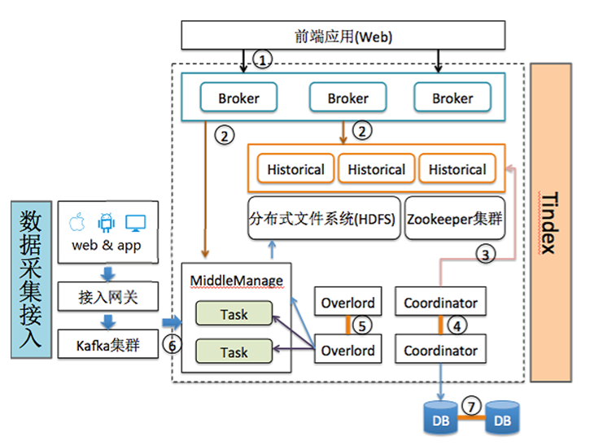

Tindex技术白皮书
==================================================

## 摘要  

Tindex是一个基于原始数据存储的多维实时分析分布式数据仓库，该系统融合了搜索引擎的索引技术，采用分布式、无共享的体系架构。  
它具有以下特性：  
* 数据实时接入，实时可查  
* 数据无损  
* 查询指标灵活定义  
* 支持上万维度   
在本文中，我们将描述Tindex的体系结构，并详细介绍Tindex如何支持快速聚合，灵活过滤，和低延迟数据接入，以及测试结果。

## 1 引言  

互联网的发展产生了大量的数据，如何存储和分析这些数据，显得越来越重要，对于技术来说，亦是挑战。目前，对于这些数据的存储分析还主要是两种方式：
一种是基于Hadoop的离线批量处理，例如Hive；另外一种是预聚合处理。  

Hadoop项目已经相当成熟，3.0的新特性更是吸引了很多人的目光，被许多组织机构或公司部署用于大规模日志数据的存储和分析。
Hadoop正在或已经帮助一些公司做大数据分析，将聚合结果转化的一系列应用(比如商业智能BI和A-B测试)都卓有成效。
具体来说，Hadoop非常擅长存储并提供大规模数据的访问。虽然Hadoop是一个高可用的系统，但它目前解决的问题还是局限在数据存储和批处理，
根本无法保证数据实时性，无法做到数据接入即可随机查询，更无法做到查询的秒级响应。  

正是由于Hadoop的局限性，为了快速的从一个个零散的数据事件的快速聚合出价值较高的结果，近几年基于OLAP的思想的预聚合系统如雨后春笋般爆发，
最典型的代表莫过于Druid和Kylin。预聚合的框架能够做到数据的实时性和快速的并发查询，但是劣势也非常明显，它所适用的模型相对固定。
预聚合的系统通常情况下是通过定义时间、维度和指标，然后按照时间粒度将维度组合作为行，在数据接入的时候实时统计每行的指标。
如此便能保证数据的实时性，但维度组合相当于将各个维度做笛卡尔积，为了保证数据的快速查询，注定行不宜过多。
为了减少预聚合的行数，维度必须裁剪，同时也不能包含高基数维度。
这些都会限制了业务的发展，一旦业务发生变更，大部分时候需要重新调整模型，已有预聚合的数据基本不可用，需要重新调整预聚合模型。  

在数果智能早起产品开发和定位的时候，我们就已经意识到了Hadoop技术非常适合作为数据存储和批处理，
随着技术的发展，预聚合框架只能作为一个辅助功能，来提升查询性能，而实际的数据分析和查询应该是基于原始数据的，指标是可以自由定制的，而不需要重新建立模型。  

基于这些考虑，数果智能结合开源的搜索引擎技术和预聚合框架重新研发了一套存储查询分析平台Tindex。一款成功的产品，需要站在巨人的肩上，数果智能研发的Tindex也不例外。选择搜索引擎技术，因为其强大的索引机制，能够满足数据筛选过滤，甚至能够应对需要分词的场景，选择预聚合的框架则是因为它的指标定义非常灵活，两者相结合，便能够满足我们所有的查询分析场景。  

关于Tindex的详细描述，我们将从以下几方面介绍：  
* Tindex的架构实现  
* Tindex存储格式和查询分析  
* 面对的挑战和发展  
* 与大数据生态圈的结合  

## 2 架构实现  

Tindex的架构设计参考了多种开源查询分析引擎，最终以一种无共享的架构来实现不同的功能点，任何节点都具有HA特性，可以根据生产环境任意启动不同的节点。我们相信这种设计分离了关注点，同时简化了整个系统的复杂性。不同的节点类型操作相对独立，并且不同的节点类型之间仅有极少的交互。因此，集群内通讯故障对数据可用性的影响微乎其微。另外，Tindex需要分布式文件系统（通常是HDFS、S3、DFS等），来保证其数据段文件的备份，数据端文件的备份我们通常称为Deep Storage。Deep Storage有几个好处：  
* 分布式文件保证数据不会丢失  
* 一旦数据出现异常可以从Deep Storage及时恢复  
* 可以支持离线批查询，索引格式的存储文件，相对于普通的文件存储查询速度更快  

为了解决复杂的数据分析问题，不同的节点类型组合在一起形成一个完成的工作体系。其中集群的元数据管理存储在数据库中，便于集群完全重启或节点宕机时，能够快速的恢复数据，目前默认支持的数据库包括derby、postgres和mysql。Tindex的架构图如下：  
  

Tindex共有四种类型的节点，分别为：
* 容器节点：主要用于启动实时任务，实时任务为实时接入外部数据源、生成索引并提供实时查询的进程，待任务完成后，索引数据以数据段的形式上传到HDFS存储
* 管理节点：负责分配容器节点对任务调度、关闭和运行的监控，以及统一管理系统的数据段信息
* 历史数据节点：从HDFS下载数据段，解析数据段提供查询
* 数据查询节点：通过数据段的元数据获取整个系统数据段的信息，包括实时任务正在处理的数据段，分解查询任务到相应的实时任务和历史数据节点，然后合并查询结果，从而统一对外提供查询服务  

### 2.1 实时任务  
实时任务进程由容器几点调起，但实际由管理节点管理。管理节点接收到需要接入数据请求后，根据请求的描述依据事先配置的调度策略来调度不同的容器启动相应的实时任务。用户可以根据需要自由选择调度策略，系统默认为公平调度，优先选择空闲容量较大的容器节点。管理节点则会轮询查个各个任务的状态，一旦任务状态失败，则会自动重新选择容器节点调启任务。  

Tindex的实时任务为了保证实时性，可以对接分布式消息中间件，例如Kafka、Metaq等，通常单进程接入速度每秒可以达到30k以上条消息，并且依据分布式消息中间件的Partition增加接入进程数，从而线性提高数据接入速度。数据接入后，首先写入进程内消息队列(disruptor)，可以根据CPU的处理能力，配置合适的消费线程数来提升数据索引速度。即使单线程消费，通常数据从接入到索引，需要的时间也不到1毫秒，一旦有新的数据段产生，将会及时通知到管理节点，数据索引后便可立即可查。  

为了保证数据索引速度，通常数据索引先在内存进行，到达阀值后，依次然后落地到硬盘为不同的SubSegment，在实时任务结束时，会统一合并所有的SubSegment为不可变的Segment。并且在整个过程中，可以根据具体情况指定合适的合并策略，在SubSegment到达一定的数量时，自动合并为较大的SubSegment。这种方式和Hbase的LSM有很多相似性，如此便可一方面能提升最后实时任务合并所有SubSegment速度，另外一方面较少的SubSegment能带来一定的查询性能提升。  

此外，实时任务还具有数据准确性的特点。消息中间件的消息，Tindex实时任务在消费的时候，保证每一条数据都得到处理。实时任务会每处理一条消息，都回记录其offset信息，一旦任务完成后，通过数据库事务保证Segment信息写入数据库，且该Segment一定上传到分布式文件系统。为了保证查询数据的信息一致，实时任务会待查询任务移交到历史数据节点后，才会关闭。  

### 2.2 历史数据节点   
历史数据节点加载实时任务创建的不可变Segment，并提供查询分析的功能。在实际的生产环境中，大部分数据是不可变的，因此，历史数据节点通常是Tindex集群的主要工作者。历史数据节点遵循无共享架构，所以，节点之间没有公共资源竞争。节点之间互不知晓，因此操作上较为简单。它们仅仅知道如何加载、删除和提供不可变Segment的服务。  

管理节点将加载和删除Segment的指令通过Zookeeper发送给历史数据节点，指令包含了Segment在Deep Storage中的位置，以及如何解压和处理Segment。在历史数据节点从Deep Storage下载某个指定的Segment之前，它首先检查本地缓存，缓存中维护了一组关于哪些Segment已经存在于当前节点的信息。如果Segment
在本地缓存中不存在，历史数据节点将会从Deep Storage中下载上述指定的Segment。一旦下载执行完成，Segment的相关信息就会通知到管理节点。此时，Segment即可被查询。本地缓存也允许历史数据节点快速更新和重启。在初始化的时候，节点检索其自身缓存的所有数据并立即提供数据服务。历史数据节点可以支持一致性读(read consistency)因为它们仅处理不可变数据。不可变数据块也允许简单的并行化模型：历史数据节点可以并行地扫描和聚合不可变数据块，而不会被阻塞。  

#### 2.2.1 层  
历史数据节点根据不同的层，可以分为不同的组。在一个给定的层中，所有的节点都使用统一的配置。可以为每一层设置不同的性能和容错能力参数。  把节点分层的目的是为了能够根据Segment的重要性，将数据设定为更高或者更低的优先级分发。举例来说，可以将拥有更多核心（core）和更大内存容量的历史数据节点提升到“热数据”层(“hot” Tier)。热数据集群可以配置用以下载更经常被访问的数据。同样的，也可以用更少的强大硬件来创建冷数据集群。冷数据集群中将紧紧含有那些不经常被访问的Segment。  

#### 2.2.2 可用性  
历史数据节点的Segment加载和卸载指令依赖Zookeeper。 假如Zookeeper变得不可用，历史数据节点就不能再提供新数据或者删除旧数据，然而，由于查询服务是基于HTTP协议的，历史数据节点仍然可以基于它们现有的数据为查询请求提供响应。这意味着Zookeeper停机不影响历史数据节点的现有数据可用性。

四种节点各自独立，相互通过Zookeeper协调工作，各司其职。管理节点通过Zookeeper选举Leader，来避免脑裂的情况出现，管理实时任务和数据段，容器节点负责调度实时任务来实时写索引、实时查询和备份数据段到分布式文件系统，历史数据节点下载不变的索引文件提供查询历史数据的查询，查询节点合并实时任务和历史数据节点的查询结果。在整个过程中，保证数据的一致性，不会存在丢失数据的情况。  

Tindex被设计用于实时的接入大量日志类数据，并能够对接入的数据即席查询分析。日志类数据通常都是时间序列的，Tindex利用这一特性，在数据接入的时候，将数据分散到不同的Segment管理数据。
